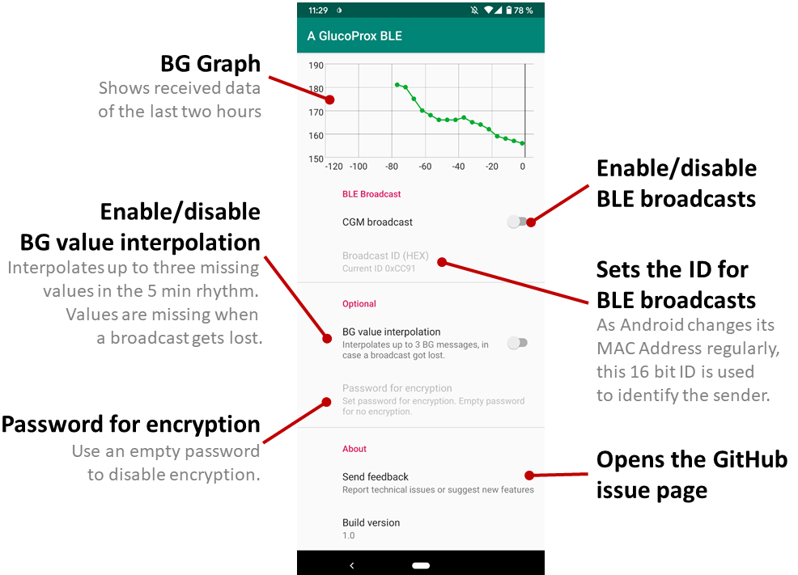
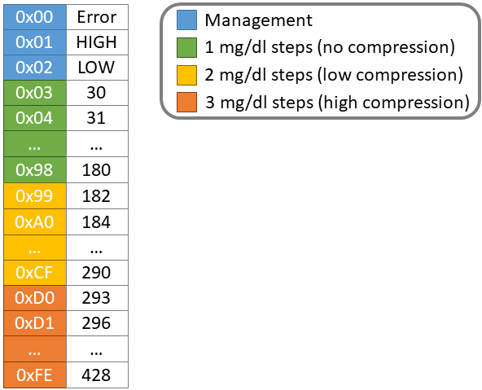

# GlucoProxBLE
GlucoProxBLE aims to provide BG readings to other devices without requiring an Internet connection.
Therefore it reads broadcasts from CGM application (e.g. xDrip) and sends them as BLE advertisements.
This should be a very (energy) efficient way to provide CGM readings to one or more receiving devices for further use (e.g. therapy assistance).

**NOTE**: Currently only mg/dl is supported. Check back later for mmol/l support.

## Warning !

This repository contains **very preliminary** code, intended for collaboration among developers.
It **is not ready** for end users and may be subject to rebasing without notice.

## Features
* Receiving broadcasts from:
  * xDrip+
  
* Sending BLE advertisements when received a new value
* AES encryption of the values
* Minimal user interface including a graph view to illustrate the data

## Interface


## Receiving Data
A receiver has to scan for BLE advertisements to receive the packages.
As Android randomly changes its MAC address, a device ID is set via the user interface to identify the sender.

To receive the data on Debian-Linux based systems, install `bluez` and `bluez-hcidump` and run the following code:

```
sudo hcitool lescan --duplicates &  
sudo hcidump --raw
```

### Understanding BLE advertisement packet format
`sudo hcidump --raw` will produce a output similar to this:

```
61:B0:ED:D1:F0:22 (unknown)
> 04 3E 20 02 01 02 01 22 F0 D1 ED B0 61 14 13 16 1F 18 03 00
  A2 A1 A1 A1 A3 A4 01 A3 A2 00 00 00 9D 9E B3
``` 

* `0x 04` Preamble  
* `0x 3E 20 02 01` Access Address (maybe keep in mind for later use)
* `0x 02` Advertising package type: ADV_NONCONN_IND -> non-connectable undirected advertising event
* `0x 01` -> 0b0001 -> 00 Reserved -> 0 RxAdd 1 TxAdd (no idea ...)
* `0x 22 F0 D1 ED B0 61` MAC Addresse (wich is changed regularly on Android)
* `0x 14` BIT[8:13]：advertising data length （Maximum 37 bytes) BIT[14:15]：Reserved -> 0b 00**01 0100** -> 20
* `0x 13` Size: 19
* `0x 16` Type: Service Data
* `0x 1F 18` Service-UUID: 0x181F -> CGM
* `0x 03 00` 10 bit Broadcast ID (set by user) -> 0x0003 -> 3  
* `0x A2 A1 A1 A1 A3 A4 01 A3 A2 00 00 00 9D 9E` (Size - Type - ServiceUUID - BroadcastID = in this case 14) BG readings in 5min rythm. Missing readings are filled with 0x00.
* `0x 03 00` CRC? (should be 3 bytes...)


**NOTE**: If you have the missing information, consider opening an issue or sending a pull request :)

### Value Compression
Since advertisements can only carry very limited data, I wanted to fit one BG value into one byte. 
Therefore, I designed a very simple lossy compression method:
It is based on the assumption, that we don't need a exact value in high blood sugar range. 
Thus, the compression algorithm uses a higher step size than 1 mg/dl for the higher blood sugar range.
One byte is coded as following:

* `0x00` error or no value
* `0x01` LOW (<30 mg/dl)
* `0x02` HIGH (>428 mg/dl)
* `0x03 - 0x98` normal span for 30-180 mg/dl
* `0x99 - 0xCF` low compressed span for 182-290 mg/dl
* `0xD0 - 0xFE` high compressed span for 293-428 mg/dl



### Encryption
Currently I have no idea how to decrypt the messages.
Therefore, I recommend setting an empty password to disable the feature, or take a look at the encryption code in the class `.ble.AesEncryptionHelper` and update this section :)

## TODO
* Update documentation (especially missing parts of BLE package format)
* Verify that "Foreground Services" are good enough to run in background reliably
* Understand how to decrypt AES encrypted messages
* Provide a receiver app example for RPi & ESP32
* testing, testing, testing ...

[//]: # (Note to future me: Look at this --> https://ukbaz.github.io/howto/beacon_scan_cmd_line.html)